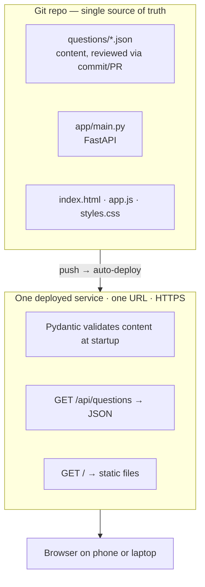

# Plan & architecture

Living document. Edit it when decisions change — a plan that disagrees with
reality is worse than no plan.

Last updated: 2026-09-12

## Goals & constraints

- **Learning goal:** the whole arc, idea → deployed. Play to Python (FastAPI).
- **Product goal:** free and publicly usable to start; keep the door open to a
  real product later.
- **Scope discipline:** the app stays a tiny walking skeleton. Depth of the
  pipeline, not breadth of features.
- **Ship target:** mobile-friendly website. PWA later as a bounded stretch.
  No app-store app.
- **Runtime:** Python 3.14, pinned in `.python-version` so local and production
  match. (3.10 lost security support in October 2026.)

## Architecture

### Three deliberate decisions

**Content lives in git as files, not in a database.**
Questions are hand-written, LLM-drafted, and sourced from public material — all
of which need review before publishing. Git already provides diffs, history and
review. A database plus an admin UI would be a worse reimplementation of that,
with a login screen attached. Fixing a bad question is an edit and a redeploy.

**One deployable, not two.**
FastAPI serves both the API and the static files from one origin. The textbook
split (static files on a CDN, API elsewhere) means immediately dealing with
CORS. One origin avoids that entirely. Splitting later is easy.

**No database until there is a write path (phase 3).**
A read-only database rebuilt from files on every deploy teaches SQL syntax and
none of the real lessons — migrations, concurrent writes, backups, pooling.
Those arrive with attempt logging, so the database arrives then too.

## Phases

Each phase ends with something deployed and working.

### Phase 1 — "Hello, production" ← in progress
The minimal complete slice: the whole arc, idea to public URL.
- [x] FastAPI app; `GET /api/questions` and `/api/health`; serves the static site
- [x] Frontend moved to `static/` so the repo root is never web-exposed
- [x] `app.js` fetches the API instead of the local file (one line changed)
- [x] Pydantic models validate every question at startup — bad content fails
      the boot instead of shipping
- [x] 13 pytest tests, covering the API and the content itself
- [x] Python 3.14, pinned
- [ ] **Pushed to GitHub**
- [ ] **Deployed to a public HTTPS URL** ← the only thing left

Validation ended up richer than planned, which is deliberate — it is the safety
net phase 2 leans on:
- `NonEmptyStr` (strips whitespace, requires content) on id, question,
  explanation and every option
- `correctIndex` must point at an option that exists
- options must be unique within a question
- ids must be unique across the set
- `category` is a `StrEnum`, so a typo cannot invent a phantom category

### Phase 2 — Content
The actual product work, and where most of the value is.
- Grow to ~50 real questions (adding categories to the `Category` enum as needed)
- Add `source` (where the fact came from) and a `verified` flag, so unreviewed
  LLM-drafted questions can be kept out of the served set
- GitHub Action running the tests on every push, so broken content cannot deploy
- `localStorage` so a refresh does not wipe a run (no accounts needed)
- Add a formatter (`ruff format`) before the codebase grows

### Phase 3 — The write path
- Log anonymous attempts: question id, right/wrong. No personal data.
- Postgres, migrations, connection handling — with a real reason to exist
- Payoff: discover which questions everyone gets wrong, i.e. which to fix

### Phase 4 — Accounts (defer hard)
Only if real usage demands it. Auth, password resets, email, and GDPR
obligations the moment personal data is stored. Being account-free is a feature.

### Phase 5 — PWA
Manifest + service worker. Installable, works offline.

## Open questions

- [ ] **Exam status.** Confirm the current status and format of the Swedish
      citizenship knowledge requirement via Migrationsverket / official sources.
      If the format is not final, keep phases 1–2 lean.
- [ ] **Hosting.** Render (simplest; free tier sleeps, ~30–50s cold start) vs
      Fly.io (more capable, Stockholm region, more concepts). Check current
      pricing — free tiers change.
- [ ] **Copyright rule.** Facts are not copyrightable; the expression of a
      question is. Decide the rule now, at 8 questions, not at 200. Working
      assumption: write original questions from factual source material, never
      transcribe official sample questions verbatim.
- [ ] **Pass threshold.** Currently a placeholder 75% in `renderResult()`.

## Deliberately not doing

Accounts, payments, native apps, a CMS, i18n, a front-end framework. Each stays
out until something concrete forces it in.
